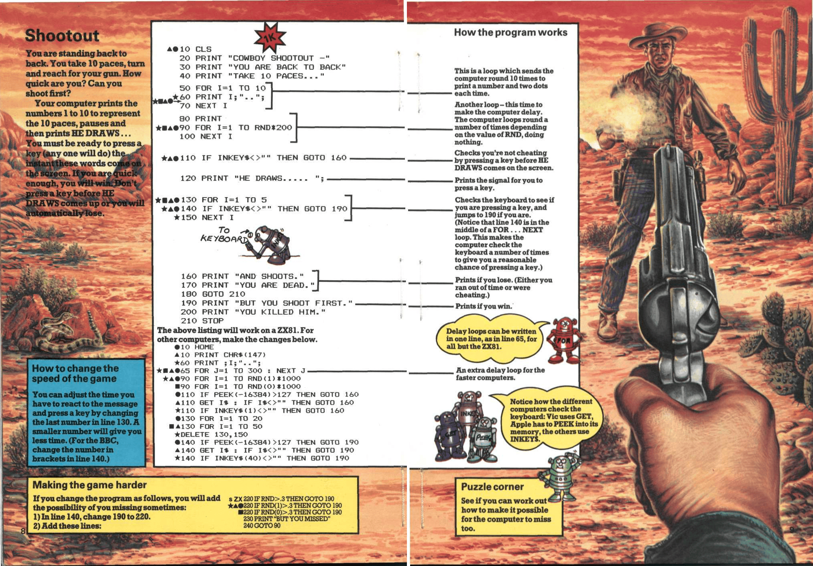

# Cowboy Shootout

Introducing my version of the classic "Cowboy Shootout" game from Usborne's Computer Battlegames. Originally designed for microcomputers such as the ZX81, ZX Spectrum, BBC, VIC 20, TRS-80, Pet, and Apple micros, I've decided to recreate this simple yet fun game using vanilla JavaScript.



[Demo](https://stautuan.github.io/shootout-js/)

### How it works

> Your computer prints the numbers 1 to 10 to represent the paces, pauses and then prints HE DRAWS... You must be ready to press any key (any one will do) the instant these words come on the screen. If you are quick enough, you will win. Don't press a key before HE DRAWS comes up or you will automatically lose.

### Built with

```
- HTML
- CSS Custom Properties
- JavaScript
```
